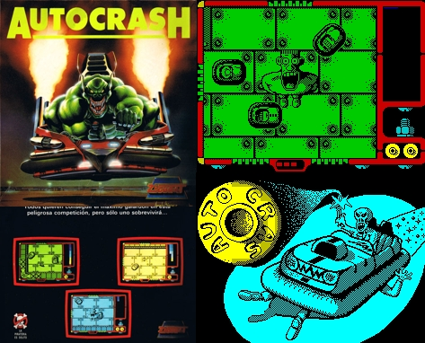
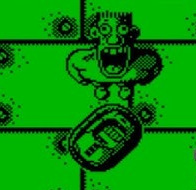
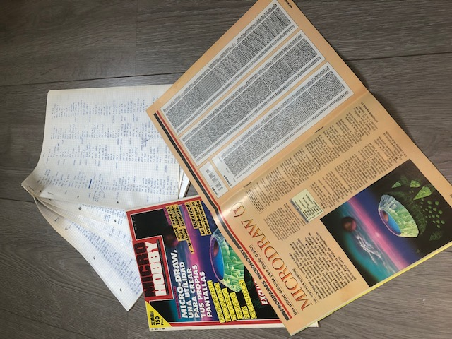
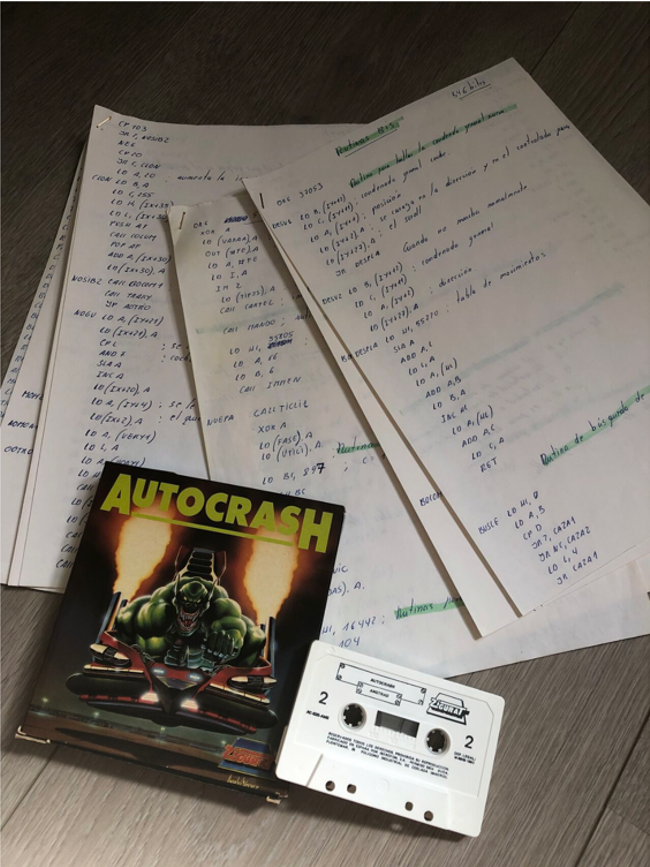

## ZX Spectrum

El original se desarrolló para ZX Spectrum 48K. Eso significa:

- 48 KB de RAM total.
- CPU Z80 a 3.5 MHz.
- Sin hardware de sprites.
- Sin aceleración gráfica.
- Sonido básico por beeper.

Cada decisión estaba condicionada por la memoria y el tiempo de CPU. No existía el concepto de “optimizar después”. El diseño ya era optimización.

## Arquitectura original

El juego estaba escrito íntegramente en ensamblador Z80.

No había motor.  
El “motor” era el propio juego.

El bucle principal era simple:

1. Leer teclado.
2. Actualizar físicas.
3. Comprobar colisiones.
4. Renderizar.
5. Repetir.

Sin multitarea. Sin abstracciones. Sin capas.

## Representación gráfica

El Spectrum no tenía sprites por hardware.  
Todo se dibujaba manipulando directamente la memoria de vídeo.

La memoria estaba dividida en:

- Bitmap (6144 bytes).
- Atributos de color (768 bytes).

El color no era por píxel, sino por bloques de 8x8. Eso obligaba a diseñar gráficos con cuidado.

Los coches estaban construidos con máscaras y rutinas de XOR o AND/OR, optimizadas para minimizar ciclos de CPU.

## Físicas

Las físicas eran enteras.  
Nada de floats.

Velocidad, aceleración y dirección se representaban con enteros escalados.

La colisión era aproximada. No había geometría compleja.  

El objetivo no era realismo. Era diversión. 

## Memoria

El mapa, los sprites, la lógica y el sonido convivían en un espacio extremadamente reducido.

Cada byte ahorrado era un logro.

Muchas decisiones de diseño no eran artísticas.  
Eran consecuencia directa de la memoria disponible.

## MicroDraw y el nacimiento de las herramientas

Autocrash fue mi primer juego, pero no fue lo primero que programé.

Antes vino la herramienta.

MicroDraw fue un programa de diseño gráfico para ZX Spectrum que desarrollé y que publicó la revista MicroHobby en dos números consecutivos, llegando a ser portada en uno de ellos.

En aquel momento no lo veía así, pero estaba aprendiendo algo fundamental: antes de crear mundos, necesitas herramientas para construirlos.

## Y el código fuente

Antes del ensamblador había papel.

El código de MicroDraw y de Autocrash no empezó en un editor.  
Empezó manuscrito, a bolígrafo, sobre papel, con tachones, flechas y grapas sujetando las hojas.

El tiempo frente al teclado era limitado. Los errores eran costosos. No había autocompletado, no había depurador avanzado, no había control de versiones.

El papel era el primer compilador.

## Pensar antes de escribir

Escribir código a mano cambia la forma de pensar.

Cada instrucción se reflexiona antes de existir.  
Cada salto condicional se traza como si fuera un circuito.  
Cada dirección de memoria se anota y se verifica.

---

